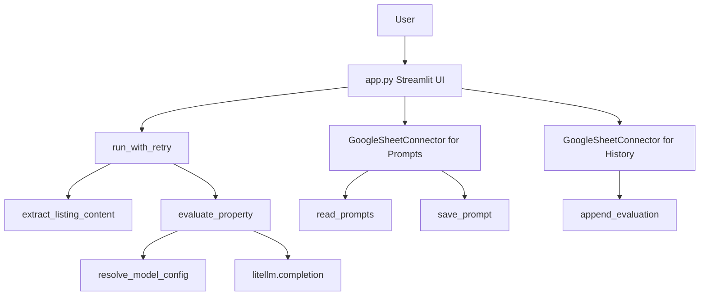

# Property Evaluator Architecture

This document describes the current runtime architecture of the Streamlit property evaluator and the relationships between its functions. The main entry point is `app.py`.

## System Overview

The application accepts a property listing URL, extracts readable page text, sends that text to a selected large language model, displays the generated report, and optionally stores the report in Google Sheets.



## Runtime Flow

1. `app.py` creates one `GoogleSheetConnector` for the evaluation history worksheet and one for the prompt worksheet.
2. The sidebar reads available prompts through `sheet_db_prompts.read_prompts()` and builds a name-to-content map.
3. When the user submits a URL, the app calls `run_with_retry()` around `scraper.extract_listing_content()`.
4. The extracted text is passed to `run_with_retry()` around `llm_service.evaluate_property()`.
5. `evaluate_property()` selects the system prompt, calls `resolve_model_config()`, and invokes `litellm.completion()`.
6. The report is stored in Streamlit session state and rendered after the processing block.
7. When the user selects **保存结果**, the app calls `sheet_db.append_evaluation()`.

## Modules and Functions

### `app.py`

#### `run_with_retry(task_name, func, max_retries=2, delay_seconds=1.5)`

Runs a callable and retries it after an exception. It reports retry progress through Streamlit and raises a `RuntimeError` containing the task name after the retry limit is exhausted.

References:

- Called by the listing evaluation flow in `app.py`.
- Receives `extract_listing_content()` as its first task callable.
- Receives `evaluate_property()` as its second task callable.

#### Streamlit application flow

The remaining logic in `app.py` is top-level Streamlit orchestration rather than named functions. It owns:

- Access-code verification with `hmac.compare_digest()`.
- Model, API key, and prompt selection.
- Prompt loading through `sheet_db_prompts.read_prompts()`.
- Prompt persistence through `sheet_db_prompts.save_prompt()`.
- Listing evaluation through `run_with_retry()`.
- Report persistence through `sheet_db.append_evaluation()`.
- Report rendering and clipboard-copy iframe generation.

### `scraper.py`

#### `extract_listing_content(url)`

Downloads a listing page with `requests.get()`, raises a `RuntimeError` for HTTP or network failures, removes scripts/styles/navigation elements with BeautifulSoup, normalizes visible text, and truncates the result to 8,000 characters.

References:

- Imported by `app.py`.
- Called inside `run_with_retry()` when an evaluation starts.

### `llm_service.py`

#### `resolve_model_config(model_name, custom_api_key=None)`

Maps a model name to the provider-specific API key and optional API base URL. Gemini uses `GOOGLE_API_KEY` or `GEMINI_API_KEY`; DeepSeek uses `DEEPSEEK_API_KEY` and its configured endpoint; other models use OpenAI settings.

References:

- Called by `evaluate_property()`.
- Reads environment variables loaded by `load_dotenv()`.

#### `evaluate_property(model_name, listing_text, custom_api_key=None, system_prompt=None)`

Builds system and user messages, chooses the supplied prompt or `SYSTEM_PROMPT`, resolves provider configuration, calls `litellm.completion()`, and returns the first response message. Provider failures are converted to a `RuntimeError`.

References:

- Imported by `app.py`.
- Called inside `run_with_retry()` after scraping succeeds.
- Calls `resolve_model_config()`.
- Calls the external `litellm.completion()` API.

### `google_sheet_connector.py`

#### `GoogleSheetConnector.__init__(spreadsheet_url, worksheet="Sheet1", connection_name="gsheets")`

Stores the target spreadsheet and worksheet, then creates a Streamlit `GSheetsConnection`.

#### `GoogleSheetConnector.read_records(ttl=0)`

Reads evaluation history and returns a standard empty DataFrame if the sheet is empty or unreadable. This method is used by `append_evaluation()`.

#### `GoogleSheetConnector.append_evaluation(url, model_name, report)`

Reads existing history, creates a timestamped row, concatenates the row, and replaces the worksheet contents with the updated DataFrame.

References:

- Called by the **保存结果** action in `app.py`.
- Calls `read_records()`.
- Calls the connector's `update()` method.

#### `GoogleSheetConnector.read_prompts(ttl=0)`

Reads and validates the `Name` and `Prompt` columns from the prompt worksheet.

References:

- Called by the sidebar in `app.py`.
- Called by `save_prompt()` before a prompt is inserted or updated.

#### `GoogleSheetConnector.save_prompt(name, prompt, overwrite=False)`

Prevents duplicate prompt names unless overwrite is enabled, then updates an existing row or appends a new row and writes the prompt worksheet back to Google Sheets.

References:

- Called by both prompt-save actions in `app.py`.
- Calls `read_prompts()`.
- Calls the connector's `update()` method.

### `prompts_store.py`

This module provides a local JSON prompt store, independent of the Google Sheets prompt store used by the current Streamlit UI.

- `load_prompts()` reads `prompts.json` at import time and returns an empty dictionary on failure.
- `list_prompt_names()` reads names from the module-level `PROMPTS` dictionary.
- `get_prompt(name)` retrieves one prompt from `PROMPTS`.
- `default_prompt_name()` returns the first prompt name, if any.
- `save_prompt(name, content, overwrite=False)` validates and atomically writes a prompt to `prompts.json`.

References:

- No current imports or calls from `app.py` or the other runtime modules were found. Changes here affect the local JSON store only until another module imports it.

## Reference Graph

The direct function-reference graph is:

```text
app.run_with_retry
  -> scraper.extract_listing_content
  -> llm_service.evaluate_property
       -> llm_service.resolve_model_config
       -> litellm.completion

app sidebar
  -> GoogleSheetConnector.read_prompts
  -> GoogleSheetConnector.save_prompt
       -> GoogleSheetConnector.read_prompts
       -> GSheetsConnection.update

app save-result action
  -> GoogleSheetConnector.append_evaluation
       -> GoogleSheetConnector.read_records
       -> GSheetsConnection.update
```

## Important Boundaries

- `app.py` owns user interaction, session state, retries, and workflow sequencing.
- `scraper.py` owns HTTP retrieval and HTML-to-text cleanup.
- `llm_service.py` owns model-provider configuration and LLM requests.
- `google_sheet_connector.py` owns Google Sheets reads and writes.
- `prompts_store.py` is a separate local persistence option and is currently unused by the UI.